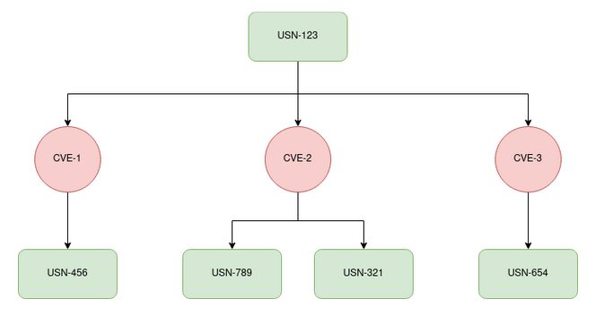

# What are related USNs

A [USN](what_is_a_usn.md) is composed by different CVEs. If a CVE appears on multiple USNs, we say
that those USNs are related. On the following image, we can see visual representation of that
concept:

A real example can be seen on [USN-5573-1](https://ubuntu.com/security/notices/USN-5573-1),
that express in the section **Related notices** that both **USN-5570-1** and **USN-5570-2**
are related to **USN-5573-1**.

This is information can useful for users that want to tackle
all related USNs at once, making sure that a CVE is indeed fixed on their Ubuntu machine.
